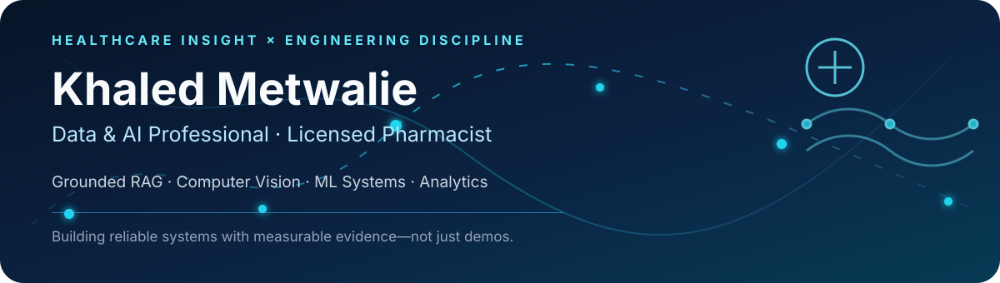

  <picture>
    <source media="(prefers-color-scheme: dark)" srcset="./assets/hero.svg">
    <source media="(prefers-color-scheme: light)" srcset="./assets/hero.svg">
    
  </picture>

    

  [Portfolio](https://khaledmetwalie.lovable.app) · [LinkedIn](https://linkedin.com/in/khaled-m-947583172) · [Email](mailto:khaledawad@hotmail.com)

## Pharmacist turned AI builder

I combine healthcare judgment with end-to-end technical delivery. My work emphasizes grounded retrieval, reproducible evaluation, explainability, testing, and systems that people can actually use.

Open to **AI Engineer, Machine Learning Engineer, Data Scientist, Data Engineer, Data Analyst, and BI** opportunities.

### Evidence at a glance

| GraphRAG platform | Healthcare RAG | Brain MRI AI | Multimodal ML |
|---|---|---|---|
| **21,854** vectors · **1,511** graph nodes | **100%** drug recall@5 · **95%** fresh held-out field recall@5 | **94.9%** test accuracy · **0.948** macro F1 | **90.07%** accuracy · **91.9×** median latency reduction |

## Selected systems

<table>
<tr>
<td width="50%" valign="top">

### [Digiler AI](https://github.com/kahledawad2019-netizen/Digiler-AI)

Adaptive learning platform combining hybrid retrieval, GraphRAG, multimodal search, student modelling, reinforcement learning, and coordinated AI agents.

- 257 indexed resources and 21,854 vectors
- 1,511-node / 5,091-edge concept graph
- 1.00 grounding and citation accuracy across 40 GraphRAG queries
- 240 passing platform and backend tests

`Python` `GraphRAG` `Qdrant` `FastAPI` `Agents`

</td>
<td width="50%" valign="top">

### [AdaptiveScan](https://github.com/kahledawad2019-netizen/Mindscan-brain-Tumor)

Explainable brain-MRI classification and localization with EfficientNet-B2, Grad-CAM/Grad-CAM++, independent segmentation, human feedback, and structured reporting.

- 94.9% test accuracy
- 0.948 macro F1
- 0.988 macro AUC
- Leakage-aware image split and production operating point

`PyTorch` `TensorFlow` `FastAPI` `Streamlit` `XAI`

</td>
</tr>
<tr>
<td width="50%" valign="top">

### [HYDRA-Net](https://github.com/kahledawad2019-netizen/hydra-net)

Cascaded multimodal counter-UAV detection with confidence-gated early exit.

- 90.07% accuracy and 0.9003 macro F1
- 0.9812 one-vs-rest ROC-AUC
- 91.9× median latency reduction
- 14 passing unit tests

`PyTorch` `Multimodal Learning` `Signal Processing` `Early Exit`

</td>
<td width="50%" valign="top">

### [Steel Defect Detection](https://github.com/kahledawad2019-netizen/steel-defect-detection)

Six-class surface-defect detection with a five-seed statistical gate and measured PyTorch, ONNX, and TensorRT deployment benchmarks.

- 0.7475 ± 0.0161 mAP@0.5 across five seeds
- 5.73 ms latency / 174.6 FPS on the measured setup
- Negative ablation results reported rather than hidden

`YOLOv8` `PyTorch` `ONNX` `TensorRT` `Statistics`

</td>
</tr>
<tr>
<td width="50%" valign="top">

### [PhARMA RAG](https://github.com/kahledawad2019-netizen/pharma-rag)

Grounded drug Q&A using dense and lexical retrieval, reranking, citations, refusal safeguards, and deterministic interaction lookup.

- 506 FDA drug records and 14,955 retrieval chunks
- 100% drug recall@5
- 95% recall@5 on a fresh held-out field set
- 26/26 end-to-end checks documented

`Python` `FAISS` `BM25` `LLM` `Docker`

</td>
<td width="50%" valign="top">

### [Hotel Cancellation Prediction](https://github.com/kahledawad2019-netizen/Hotel-Reservation-DataMining)

Seven-member end-to-end analytics project spanning SQL, Python EDA, feature engineering, ensemble modelling, and Power BI.

- 119,208 bookings and 60+ engineered features
- 92.93% accuracy
- 0.9495 F1 and 0.9766 ROC-AUC
- Eight-model comparison with a stacking ensemble

`SQL Server` `Python` `XGBoost` `Power BI` `Team Project`

</td>
</tr>
</table>

## Capabilities

- **AI and retrieval:** RAG, GraphRAG, hybrid search, reranking, vector databases, grounded generation, evaluation, agentic systems
- **Machine and deep learning:** scikit-learn, XGBoost, PyTorch, TensorFlow, YOLO, forecasting, multimodal learning, model optimization
- **Data and analytics:** Python, SQL/T-SQL, Pandas, NumPy, Power BI, DAX, Power Query, Microsoft Fabric, Excel
- **Engineering and deployment:** FastAPI, Streamlit, REST APIs, Docker, GitHub Actions, testing, ONNX, TensorRT
- **Domain:** pharmacy, healthcare data, clinical context, medication information, safety-oriented communication

## Education and credentials

- **Scholarship Diploma in Data Analytics & Applied AI** — Digilians, Egyptian Military Academy in cooperation with Egypt's Ministry of Communications and Information Technology; completed August 2026
- **Bachelor of Pharmacy** — Mansoura University, 2023
- **Microsoft Certified: Fabric Analytics Engineer Associate**
- **Microsoft Certified: Power BI Data Analyst Associate**

## Engineering principles

1. Verify claims against committed evidence.
2. Report failed experiments and uncertainty honestly.
3. Treat grounding, refusal, explainability, and data leakage as engineering concerns.
4. Optimize for reproducibility and practical use—not badge count.

## Contributions

<picture>
  <source media="(prefers-color-scheme: dark)" srcset="https://raw.githubusercontent.com/kahledawad2019-netizen/kahledawad2019-netizen/output/github-snake-dark.svg">
  <source media="(prefers-color-scheme: light)" srcset="https://raw.githubusercontent.com/kahledawad2019-netizen/kahledawad2019-netizen/output/github-snake.svg">
  
</picture>

---

  <strong>Healthcare insight. Production-minded engineering. Measurable impact.</strong> 
  <a href="mailto:khaledawad@hotmail.com">Start a conversation</a>

